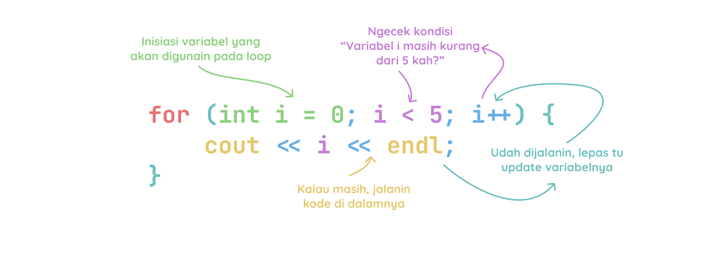

# For Loop

For loop kita gunain ketika kita udah tau kapan looping ini akan berhenti.

Struktur dari for loop adalah sebagai berikut:

```cpp
for (initialization; condition; update) {
    // kode yang akan diulang
}
```

1. **Initialization** adalah bagian yang akan dieksekusi pertama kali ketika loop dimulai. Biasanya kita gunain tuk deklarasikan variabel yang akan digunakan dalam loop.

2. **Condition** adalah bagian yang akan dievaluasi sebelum setiap iterasi loop. Jika hasil evaluasi ini adalah `true`, maka loop lanjut. Jika `false`, maka loop udahan.

3. **Update** adalah bagian yang akan dieksekusi setelah setiap iterasi loop. Biasanya kita gunain tuk update variabel yang digunakan dalam loop.

Contoh:

```cpp
#include <iostream>
using namespace std;

int main() {
    for (int i = 0; i < 5; i++) {
        cout << i << endl;
    }
    return 0;
}
```

Output:
```bash
0
1
2
3
4
```

Ilustarasi for loop:



Source:
-[https://www.w3schools.com/cpp/cpp_for_loop.asp](https://www.w3schools.com/cpp/cpp_for_loop.asp)
