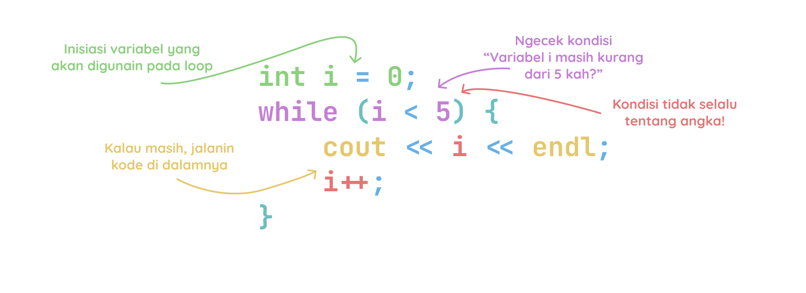

# While Loop

While loop kita gunain ketika kita gak tau kapan looping ini akan berhenti.

Struktur dari while loop adalah sebagai berikut:

```cpp
while (condition) {
    // kode yang akan diulang
}
```

1. **Condition** adalah bagian yang akan dievaluasi sebelum setiap iterasi loop. Jika hasil evaluasi ini adalah `true`, maka loop lanjut. Jika `false`, maka loop udahan.


Contoh:

```cpp
#include <iostream>
using namespace std;

int main() {
    int i = 0;
    while (i < 5) {
        cout << i << endl;
        i++;
    }
    return 0;
}
```

Output:
```bash
0
1
2
3
4
```

Ilustasi while loop:


Source:
- [https://www.w3schools.com/cpp/cpp_while_loop.asp](https://www.w3schools.com/cpp/cpp_while_loop.asp)
