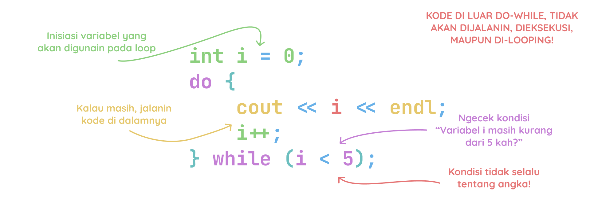

# Do While Loop

Do-while loop ini mirip dengan while-loop, bedanya ini dijalanin dulu sekali baru dicek kondisinya.

Struktur dari do-while loop adalah sebagai berikut:

```cpp
do {
    // kode yang akan diulang
} while (condition);
```

1. **Condition** adalah bagian yang akan dievaluasi setelah setiap iterasi loop. Jika hasil evaluasi ini adalah `true`, maka loop lanjut. Jika `false`, maka loop udahan.

Contoh:

```cpp
#include <iostream>
using namespace std;

int main() {
    int i = 0;
    do {
        cout << i << endl;
        i++;
    } while (i < 5);
    return 0;
}
```

Output:
```bash
0
1
2
3
4
```

Ilustasi do-while loop:


Source:
- [https://www.w3schools.com/cpp/cpp_do_while_loop.asp](https://www.w3schools.com/cpp/cpp_do_while_loop.asp)
