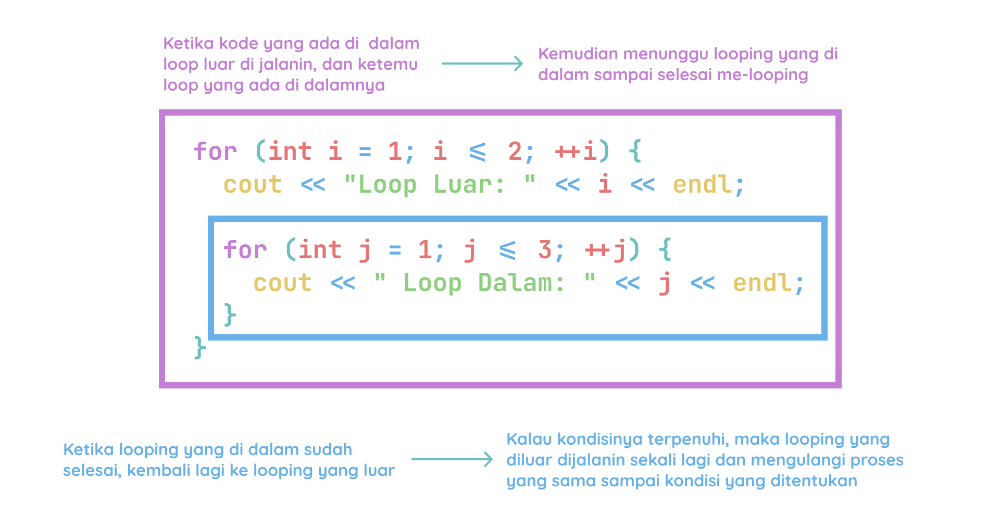

# Nested Loop

Nested loop adalah loop yang ada di dalam loop. Nested loop ini biasanya digunakan untuk mengakses elemen array 2 dimensi.

Contoh:

```cpp
#include <iostream>
using namespace std;

int main() {
  // Loop Luar
  for (int i = 1; i <= 2; ++i) {
    cout << "Loop Luar: " << i << endl; // 2 kali dijalanin
    
    // Loop Dalam
    for (int j = 1; j <= 3; ++j) {
      cout << " Loop Dalam: " << j << endl; // 6 kali dijalanin (2 * 3)
    }
  }
  return 0;
}
```

Output:

```bash
Loop Luar: 1
 Loop Dalam: 1
 Loop Dalam: 2
 Loop Dalam: 3
Loop Luar: 2
 Loop Dalam: 1
 Loop Dalam: 2
 Loop Dalam: 3
```

Ilustrasi nested loop:



Source:
- [https://www.w3schools.com/cpp/cpp_for_loop_nested.asp](https://www.w3schools.com/cpp/cpp_for_loop_nested.asp)
