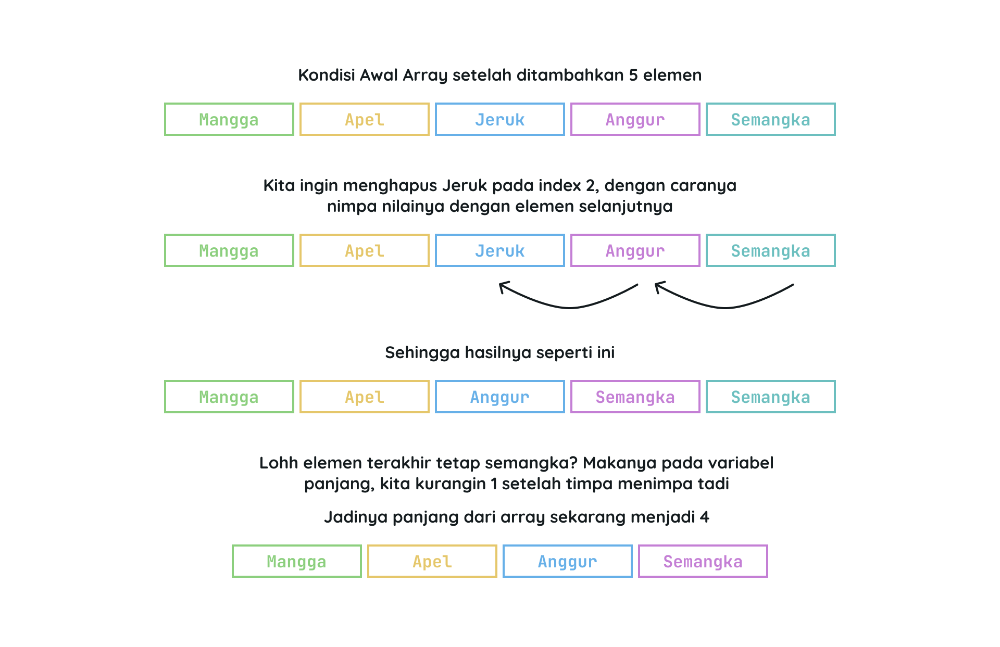

# CRUD Array

CRUD (Celect, Insert, Update, Delete) hehe bukan, malah SQL akwokoakwo. Oke izin serius chat, CRUD disini adalah Create, Read, Update, dan Delete. Kita akan bahas gimana sih caranya melakukan operasi-operasi tersebut pada array.

Kita akan buat program sederhana yang berisi array buah-buahan. Kita akan membuat array yang berisi nama-nama buah, lalu kita akan membaca, mengubah, dan menghapus elemen-elemen dari array tersebut.

## Membuat Menu Program

Kita akan buat menu program yang berisi pilihan-pilihan operasi yang bisa dilakukan pada array buah-buahan.

```cpp
#include <iostream>
using namespace std;

#define MAX_BUAH 100 // Ukuran maksimum array buah

void enterContinue() {
  cin.ignore();
  cout << "Tekan Enter untuk melanjutkan...";
  cin.get();
}

int main() {
  int panjang = 0; // Jumlah elemen saat ini
  string buah[MAX_BUAH]; // Array dengan ukuran tetap

  int pilihan, index;
  do {
    system("clear");
    cout << "Menu Program" << endl;
    cout << "1. Tampilkan Buah" << endl;
    cout << "2. Tambah Buah" << endl;
    cout << "3. Ubah Buah" << endl;
    cout << "4. Hapus Buah" << endl;
    cout << "5. Keluar" << endl;
    cout << "Pilihan: ";
    cin >> pilihan;

    switch (pilihan) {
    case 1:
      // Tampilkan buah
      enterContinue();
      break;
    case 2:
      // Tambah buah
      enterContinue();
      break;
    case 3:
      // Ubah buah
      enterContinue();
      break;
    case 4:
      // Hapus buah
      enterContinue();
      break;
    case 5:
      cout << "Program selesai" << endl;
      enterContinue();
      break;
    default:
      cout << "Pilihan tidak valid" << endl;
      enterContinue();
      break;
    }
  } while (pilihan != 5);

  return 0;
}
```

## Read Array

Kita lanjutkan ke menu pertama yaitu nampilin buah-buahan. Untuk nampilin elemen-elemen dari array, kita bisa menggunakan for-loop atau foreach-loop.

Kita gunain for loop ajah, taruh kode ini di case 1:

```cpp
if (panjang == 0) {
    cout << "Belum ada buah" << endl;
} else {
    for (int i = 0; i < panjang; i++) {
        cout << "Buah ke-" << i + 1 << ": " << buah[i] << endl;
    }
}
```

Penjelasan:

Pertama-tama, kita cek dulu apakah panjang array buah-buahan itu 0 atau tidak. Kalau 0 berarti belum ada buah yang dimasukin, jadi kita kasih pesan "Belum ada buah".

Kalau panjang array buah-buahan tidak 0, kita akan looping elemen-elemen array buah-buahan. Kita tampilkan nomor urut elemen buah-buahan dan nama buahnya.

## Create Array

Selanjutnya kita akan mengisikan elemen-elemen array buah-buahan.

Taruh kode ini di case 2:

```cpp
if (panjang < MAX_BUAH) {
    cout << "Masukkan nama buah: ";
    cin.ignore();
    getline(cin, buah[panjang]);
    panjang++;
    cout << "Buah berhasil ditambahkan" << endl;
} else {
    cout << "Kapasitas penuh! Tidak bisa menambah buah lagi." << endl;
}
```

Penjelasan:

Pertama-tama, kita cek dulu apakah panjang array buah-buahan kurang dari ukuran maksimum array buah-buahan atau tidak. Kalau kurang dari ukuran maksimum, kita minta inputan nama buah dari user, lalu kita masukkan nama buah tersebut ke dalam array buah-buahan.

Setelah itu, kita tambahkan panjang array buah-buahan dengan 1. Terakhir, kita kasih pesan "Buah berhasil ditambahkan".

Kalau panjang array buah-buahan sudah sama dengan ukuran maksimum array buah-buahan, kita kasih pesan "Kapasitas penuh! Tidak bisa menambah buah lagi."

## Update Array

Selanjutnya kita akan ubah elemen array buah-buahan. Kita akan minta inputan dari user berupa index elemen yang akan diubah, lalu kita akan minta inputan nama buah yang baru.

Taruh kode ini di case 3:

```cpp
if (panjang == 0) {
    cout << "Belum ada buah untuk diubah." << endl;
} else {
    for (int i = 0; i < panjang; i++) {
      cout << "Buah ke-" << i + 1 << ": " << buah[i] << endl;
    }
    cout << "Masukkan nomor buah yang akan diubah: ";
    cin >> index;

    if (index > 0 && index <= panjang) {
        cout << "Masukkan nama buah baru: ";
        cin.ignore();
        getline(cin, buah[index - 1]);
        cout << "Buah berhasil diubah" << endl;
    } else {
          cout << "Nomor buah tidak valid" << endl;
    }
}
```

Penjelasan:

Pertama-tama, kita cek dulu apakah panjang array buah-buahan itu 0 atau tidak. Kalau 0 berarti belum ada buah yang dimasukin, jadi kita kasih pesan "Belum ada buah untuk diubah".

Kalau panjang array buah-buahan tidak 0, kita looping elemen-elemen array buah-buahan. Kita tampilkan nomor urut elemen buah-buahan dan nama buahnya. Biar user tau nomor urut buahnya.

Selanjutnya, kita minta inputan dari user berupa index elemen yang akan diubah. Kita cek dulu apakah nomor buah yang dimasukkan user valid atau tidak. Kalau valid, kita minta inputan nama buah yang baru dari user, lalu kita ubah elemen array buah-buahan sesuai dengan index yang dimasukkan user.

## Delete Array

Terakhir kita akan hapus elemen array buah-buahan. Kita akan minta inputan dari user berupa index elemen yang akan dihapus.

Untuk menghapus elemen array di C++ tidak semudah di Ular Sanca. Kita harus menggeser elemen-elemen array setelah elemen yang dihapus. Anggap aja nimpa elemen yang nak dihapus.

Taruh kode ini di case 4:

```cpp
if (panjang == 0) {
    cout << "Belum ada buah untuk dihapus." << endl;
} else {
    for (int i = 0; i < panjang; i++) {
      cout << "Buah ke-" << i + 1 << ": " << buah[i] << endl;
    }
    cout << "Masukkan nomor buah yang akan dihapus: ";
    cin >> index;

    if (index > 0 && index <= panjang) {
      for (int i = index - 1; i < panjang - 1; i++) {
        buah[i] = buah[i + 1]; // Ngegeser elemen ke kiri kek nimpa jadinya
      }
      panjang--;
      cout << "Buah berhasil dihapus" << endl;
    } else {
      cout << "Nomor buah tidak valid" << endl;
    }
}
```

Penjelasan:

Pertama-tama, kita cek dulu apakah panjang array buah-buahan itu 0 atau tidak. Kalau 0 berarti belum ada buah yang dimasukin, jadi kita kasih pesan "Belum ada buah untuk dihapus".

Kalau panjang array buah-buahan tidak 0, kita looping elemen-elemen array buah-buahan. Kita tampilkan nomor urut elemen buah-buahan dan nama buahnya. Biar user tau nomor urut buahnya.

Selanjutnya, kita minta inputan dari user berupa index elemen yang akan dihapus. Kita cek dulu apakah nomor buah yang dimasukkan user valid atau tidak. Kalau valid, kita geser elemen-elemen array buah-buahan setelah elemen yang dihapus ke kiri satu posisi. Terakhir, kita kurangi panjang array buah-buahan dengan 1.

Ilustrasi penghapusan elemen array buah-buahan:



Tahniah, antum udah bisa CRUD array. Silahkan dicoba-coba sendiri ya. 
