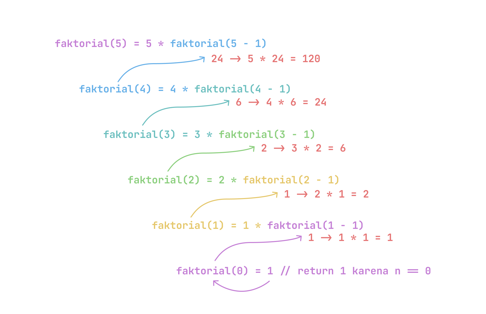

# Rekursif

Apa itu rekursif? Apa itu rekursif? Apa itu rekursif? Apa itu rekursif? Apa itu rekursif? Apa itu rekursif? Apa itu rekursif?

Yaa gitulah contoh rekursif, hehe. Rekursif adalah teknik pemrograman dimana sebuah fungsi memanggil dirinya sendiri.

Contoh paling sederhana dari rekursif adalah fungsi faktorial. Faktorial dari sebuah bilangan adalah hasil perkalian dari bilangan itu sendiri dengan semua bilangan sebelumnya hingga 1. Faktorial dari 5 adalah 5 x 4 x 3 x 2 x 1 = 120.

Contoh:

```cpp
#include <iostream>
using namespace std;

int faktorial(int n) {
    if (n == 0) {
        return 1;
    } else {
        return n * faktorial(n - 1);
    }
}

int main() {
    int n = 5;
    cout << "Faktorial dari " << n << " adalah " << faktorial(n) << endl;
    return 0;
}
```

Output:

```bash
Faktorial dari 5 adalah 120
```

Pada contoh di atas, fungsi `faktorial` memanggil dirinya sendiri dengan parameter `n - 1` hingga `n` bernilai 0. 
Ketika `n` bernilai 0, maka fungsi akan mengembalikan nilai 1. 
Kemudian, fungsi akan mengalikan nilai `n` dengan hasil dari pemanggilan fungsi `faktorial(n - 1)`.

Masih bingung? Tengok ilustrasi ni:



Nahh gampang kan? Contoh lain dari rekursif ada fungsi Fibonacci, Tower of Hanoi, dan sebagainya.

Catatan:
Rekursif bisa bikin program jadi lebih lambat dan boros memori. Jadi, gunakan rekursif dengan bijak. Dan juga rekursif mengeksekusi kode dari dalam ke luar, jadi jangan lupa kasih kondisi berhenti biar gak infinite loop.

Source:
- [https://www.w3schools.com/cpp/cpp_functions_recursion.asp](https://www.w3schools.com/cpp/cpp_functions_recursion.asp)
