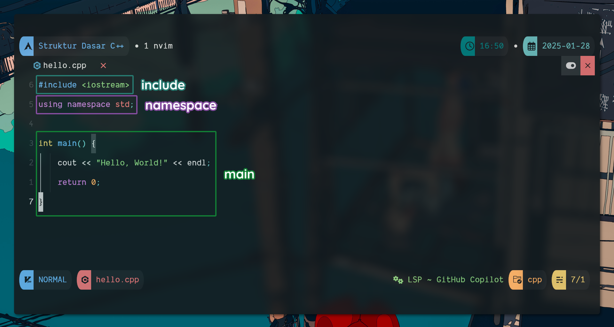

# Strutur Dasar Program C++

## Struktur Dasar Program C++

C++ punya struktur dasar program yang terdiri dari tiga bagian, yaitu:



### **include** 
Bagian ini isinya adalah library apa aja yang kita akan gunain dalam program kita. Library ini bisa berupa library bawaan dari C++ atau library yang kita buat sendiri. Kalau di Ular Sanca ini mirip-mirip ma `import`.

### **namespace**
Sifatnya opsional sih, tapi biasanya kita pake.

Contoh di atas, kita pake `std`. Karena fungsi-fungsi yang ada di `iostream` dan `string` berada di dalam namespace `std`. Jadi, kalau kita mau pake fungsi-fungsi itu, kita harus nulis `std::` dulu.

Jadinya seperti ini:
```cpp
std::cout << "Hello, World!" << std::endl;
```

Pegelkan ngetik `std::` terus?, makanya kita gunain namespace.

### **main()**
Bagian ini adalah bagian yang paling penting. Di dalamnya kita tulis semua kode program kita. Program kita akan dijalankan dari sini. Ini wajib ada di setiap program C++.

Contoh:
```cpp
#include <iostream>
using namespace std;

int main() {
    cout << "Hello, World!" << endl;
    return 0;
}
```

Nah, itu dia struktur dasar program C++.

## Comment di C++

Comment adalah bagian dari kode program yang tidak akan dijalankan oleh compiler. Comment ini berguna untuk memberikan penjelasan atau dokumentasi pada kode program kita.

Ada dua jenis comment di C++, yaitu:

### **Single Line Comment**
Comment ini dimulai dengan `//` dan berlaku untuk satu baris kode.

Contoh:
```cpp
#include <iostream>
using namespace std;

int main() {
    cout << "Hello, World!" << endl; // Ini adalah single line comment
    return 0; // Dan tidak akan dieksekusi
}
```

### **Multi Line Comment**

Comment ini dimulai dengan `/*` dan diakhiri dengan `*/`. Comment ini bisa berlaku untuk beberapa baris kode.

Contoh:
```cpp
#include <iostream>
using namespace std;

int main() {
    /* Ini adalah multi line comment
    Kita bisa menuliskan beberapa baris kode
    Tanpa harus menambahkan // di setiap barisnya */
    cout << "Hello, World!" << endl;
    return 0;
}
```

Source:
- [https://www.w3schools.com/cpp/cpp_syntax.asp](https://www.w3schools.com/cpp/cpp_syntax.asp)
- [https://www.w3schools.com/cpp/cpp_comments.asp](https://www.w3schools.com/cpp/cpp_comments.asp)
- [https://www.petanikode.com/cpp-sintaks/](https://www.petanikode.com/cpp-sintaks/)
