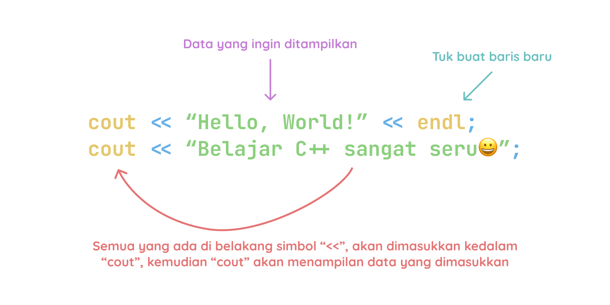
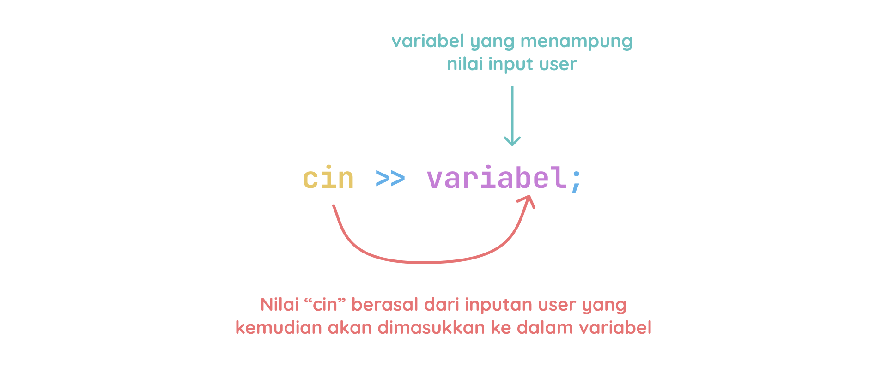

# Input dan Output pada C++

## **Output**

Output adalah informasi yang udah kita proses dan kita tampilkan ke layar. Di C++, kita bisa menampilkan output ke layar dengan menggunakan `cout`.

Struktur fungsi `cout`:



Setelah simbol `<<`, kita bisa menambahkan data yang mau kita tampilkan. Data ini bisa berupa string, angka, atau variabel.

Contoh:

```cpp
#include <iostream>
using namespace std;

int main() {
    cout << "Hello, World! ";
    cout << "Belajar C++ sangat seru😀";
    return 0;
}
```

Maka outputnya akan seperti ini:

```bash
Hello, World! Belajar C++ sangat seru😀
```

Kalau nak buat baris baru, kita bisa gunain `endl`.

Contoh:

```cpp
cout << "Hello, World!" << endl;
cout << "Belajar C++ sangat seru😀";
```

Maka outputnya akan nampilin dua baris:

```bash
Hello, World!
Belajar C++ sangat seru😀
```

Nahh simbol `<<` ini bisa kita sebut sebagai operator `insertion` atau operator masukan. Karena dia nge-insert data ke dalam `cout`. Kalau di kasus kita di atas, dia nge-insert string ke dalam `cout`. Kita juga bisa nampilin angka atau variabel.

Contoh:

```cpp
string nama = "Raana";
int umur = 20;
cout << "Halo, nama saya " << nama << " dan umur saya " << umur << " tahun";
```

Maka outputnya akan seperti ini:

```bash
Halo, nama saya Raana dan umur saya 20 tahun
```

## **Input**

Input adalah data yang kita terima dari user. Di C++, kita bisa menerima input dari user dengan menggunakan `cin`.

Struktur fungsi `cin`:



Setelah simbol `>>`, kita bisa menambahkan variabel yang akan kita isi dengan data yang diinputkan oleh user.

Contoh:

```cpp
#include <iostream>
using namespace std;

int main() {
    string nama;
    cout << "Masukkan nama kamu: ";
    cin >> nama;
    cout << "Halo, " << nama;
    return 0;
}
```

Maka outputnya akan seperti ini:

```bash
Masukkan nama kamu: Raana
Halo, Raana
```

Tapi, fungsi `cin` ini hanya nerima inputan sampai ketemu spasi. Jadi, kalau kita inputkan `Raana Matcha`, dia cuma nerima `Raana` aja. Kalau kita mau nerima inputan sampai baris baru, kita bisa gunain fungsi `getline`.

Contoh:

```cpp
string nama;
cout << "Masukkan nama kamu: ";
getline(cin, nama);
cout << "Halo, " << nama;
```

Maka outputnya akan seperti ini:

```bash
Masukkan nama kamu: Raana Matcha
Halo, Raana Matcha
```

Catatan:
Perhatikan simbol `<<` itu untuk output dan `>>` itu untuk input.

Nah, itu dia cara input dan output di C++. Selanjutnya, kita bakal belajar tentang tipe data di C++.

Source:
- [https://www.w3schools.com/cpp/cpp_output.asp](https://www.w3schools.com/cpp/cpp_output.asp)
- [https://www.w3schools.com/cpp/cpp_user_input.asp](https://www.w3schools.com/cpp/cpp_user_input.asp)
- [https://www.petanikode.com/cpp-input-output/](https://www.petanikode.com/cpp-input-output/)
