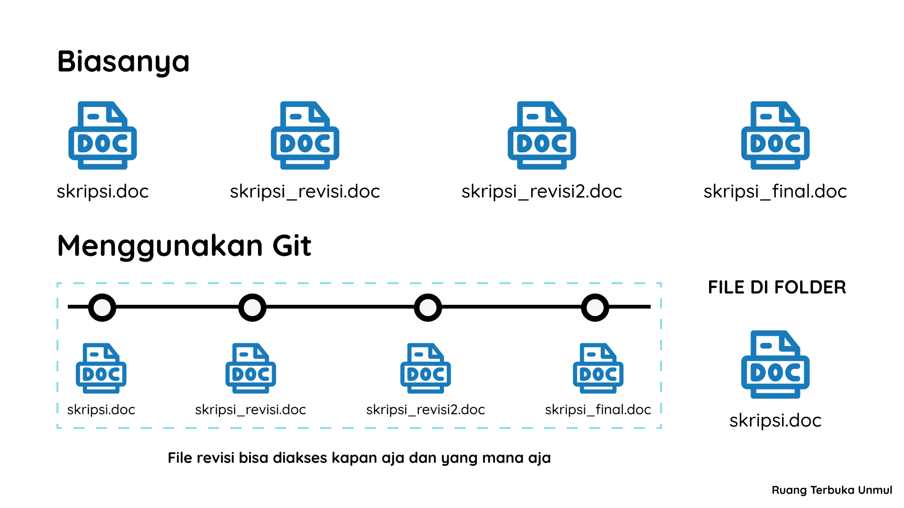

# Pengenalan Git untuk Pemula cem kalian

Sekarang ini gk zaman lagi menggunakan WhatsApp untuk bertukar file kodingan kita. Bayangin kita mengerjakan project bareng teman, Si Ucup ngedit file programRevisi.cpp, lepas tu dia mengirimkan file tersebut ke kita melalui WhatsApp. Nahh, kita mau cek yang dikerjain, apakah sudah sesuai atau belum. Tetapi kita gk tau, bagian mana aja yang dia kerjain. Jangan-jangan dia gk ngerjain sama sekali cuma mengubah nama file aja lepas tu kirim ke WhatsApp. Aduhai, jangan begitu yaa teman-teman.

Nahh, disinilah Git diperlukan, untuk men-tracking perubahan yang terjadi pada file. Jadi kita bisa mengetahui Si Ucup ini ngoding apa gk gitu😏.

## Apa sih Git itu?

Git adalah software yang digunakan sebagai Version Control System dalam sebuah project. Git ini dikembangkan oleh pembuat Linux (I use Arch btw😏 -Adi) yaitu Linus Torvalds pada tahun 2005.

Git dirancang untuk kita dimudahkan dalam berkolaborasi dan kita bisa nihh memantau riwayat perubahan pada suatu project.

## Contoh Penggunaan Git pada File Skripsi

File skripsi kita jadikan contoh karena sering banget kan disuruh revisi-revisi terus dan menyimpannya dengan nama file yang berbeda😏. Coba lihat ilustrasi berikut:

Apa dong perbedaanya?

Ketika kita menyimpan semua perubahan, biasanya kita membuat file baru dengan "save as". Kemudian, file revisian kita akan menumpuk dalam folder seperti ilstrasi di atas.

Nahh, setelah menggunakan Git, revisi file yang sebelumnya menumpuk, bisa menjadi satu file aja.

Walaupun yang terlihat cuman satu file aja, kita bisa mengakses file-file revisi yang sebelumnya. Git bakal nyimpen perubahan yang terjadi pada file skripsi kita.

## Kenapa Harus Belajar Git?

Berikut adalah beberapa alasan kenapa kita harus belajar Git:

1. Bisa mengelola versi source code dengan baik.
2. Bisa paham berkolaborasi dengan teman-teman dalam mengerjakan project.
3. Bisa ikut berkontribusi ke project open-source.
4. Lebih aman dalam berkolaborasi karena kita bisa tau apa aja yang berubah dan siapa yang merubah.
5. Bisa memahami cara deployment project dengan cara keren.
6. dan sebagainya...

## Apa selanjutnya?

Nahh, udah tau kan apa itu git, gimana kerjanya dan manfaat kita belajar git. Selanjutkan kita akan belajar gimana sih cara menginstall git pada device kita. Selalu Hello World!😏.
