# Instalasi Git

Sekarang kita akan belajar gimana sih caranya menginstall Git pada device kita. Git ini bisa diinstall pada berbagai sistem operasi, seperti Windows, MacOS, dan Linux. Skuyy, langsung aja kita mulai.

## Instalasi pada Windows

Pertama-tama, kita download dulu Git pada website resminya [disini](https://git-scm.com/downloads/win). 

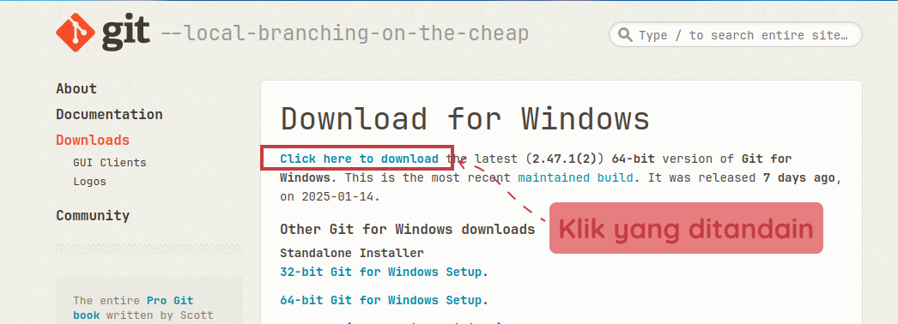

Lepas tu, kita buka file yang sudah kita download tadi. 

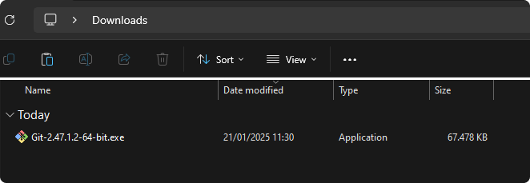

Maka akan muncul tampilan seperti ini. Klik Next.

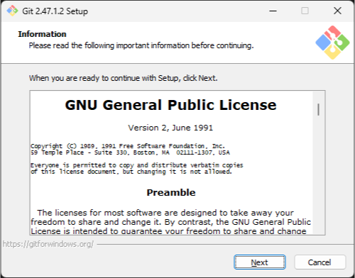

Kemudian pilih lokasi instalasi Git. Klik Next.

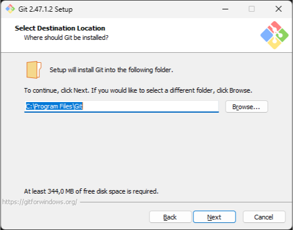

Untuk bagian komponen kita biarkan saja seperti ini. Klik Next.

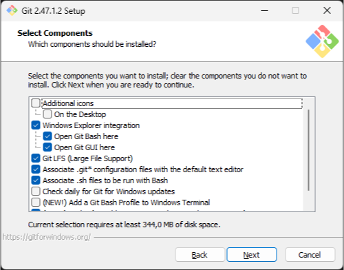

Selanjutnya pemilihan direktori start menu. Klik Next.

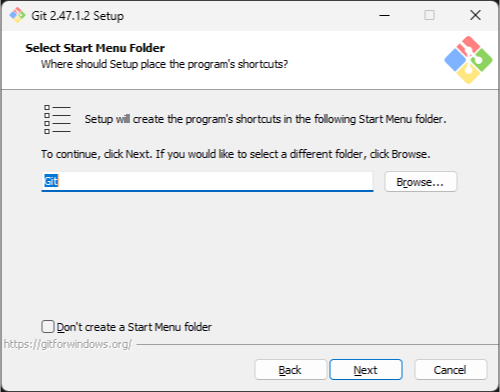

Pilih editor yang akan menjadi default editor Git, karena mayoritas dari kita menggunakan Visual Studio Code, maka pilih saja Visual Studio Code. Klik Next.


Selanjutnya kita memilih konfigurasi default branch Saat ini. Defaultnya adalah `master` ketika kita baru pertama kali membuat repository. Tetapi nama ini sudah mulai diganti menjadi `main`. Karena di Github, default branch atau branch utama yang digunakan adalah `main`.

Oleh karena itu kita akan memilih opsi kedua. Klik Next.

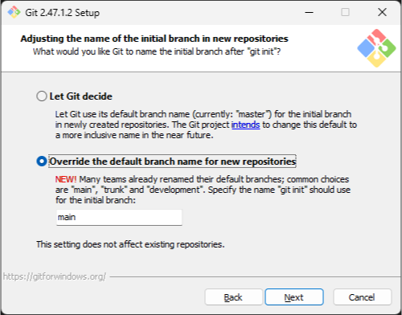

Selanjutnya kita mengatur PATH environment. Kita pilih opsi yang kedua agar command-command `git` bisa dijalankan melalui Command Prompt. Klik Next.

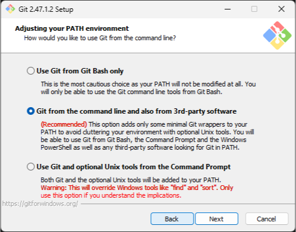

Selanjutnya konfigurasi SSH. Kita pilih opsi pertama agar kita bisa menggunakan SSH untuk menghubungkan Git dengan Github. Klik Next.

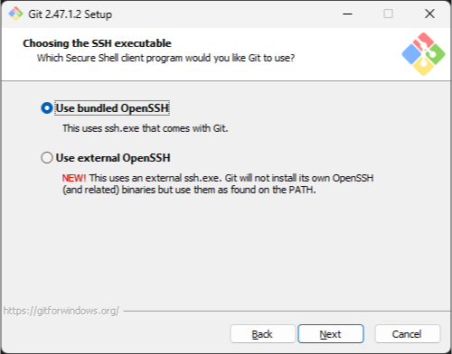

Selanjutnya kita pilih OpenSSL untuk HTTPS. Klik Next.

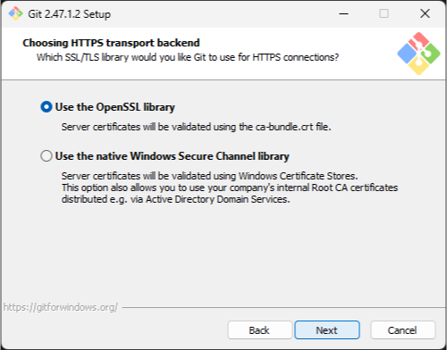

Selanjutnya kita pilih opsi pertama untuk konversi line ending. Klik Next.

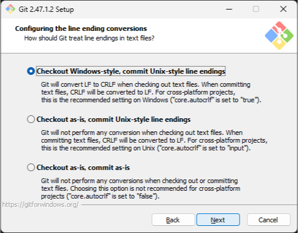

Selanjutnya kita pilih opsi kedua untuk terminal emulator. Klik Next.

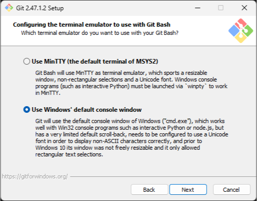

Selanjutnya opsi default behavior untuk `git pull`, kita pilih opsi pertama. Klik Next.

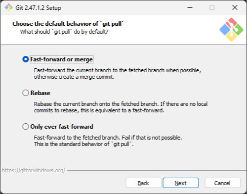

Selanjutnya kita pilih opsi pertama untuk credential helper. Git akan menyimpan credential kita agar kita tidak perlu login terus-terusan. Credential ini seperti username dan email kita. Klik Next.

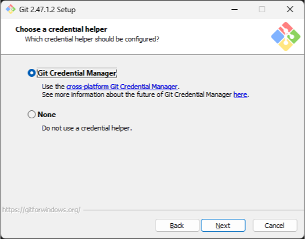

Selanjutnya untuk extra options, kita pilih opsi pertama. Klik Next.

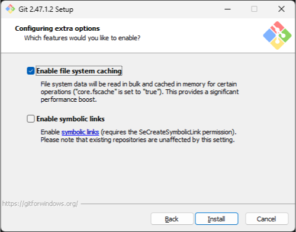

Selanjutnya kita klik Install.

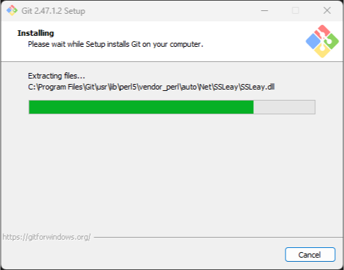

Tunggu proses instalasi selesai.

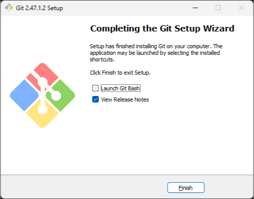

Setelah selesai, kita klik Finish. Git sudah terinstall pada device kita.
Untuk ngecek apakah Git ini sudah terinstall atau belum, kita bisa buka Command Prompt dan ketikkan command `git --version`.

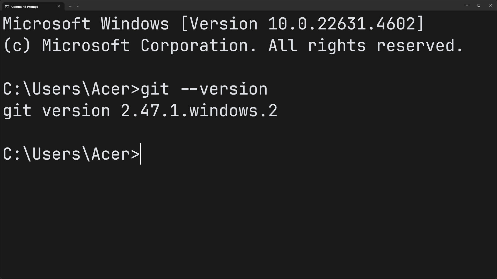

Jika muncul versi Git, artinya Git sudah terinstall pada device kita.

## Instalasi pada Linux

Nahh, untuk menginstall Git pada Linux, tidak sepanjang di Windows. Kita bisa buka terminal yang kalian suka, disini saya pakai [Kitty](https://sw.kovidgoyal.net/kitty/binary/).

Untuk masing-masing distro, kita bisa gunain package manager yang sudah disediakan:

- Debian/Ubuntu:
```bash
sudo apt-get install git
```

Untuk Ubuntu, kita perlu menambahkan repositorynya dulu:
```bash
add-apt-repository ppa:git-core/ppa
apt update
apt install git
```

- Fedora:
```bash
sudo dnf install git

atau

sudo yum install git
```

- Arch:
```bash
sudo pacman -S git
```

- Nix/NixOS:
```bash
nix-env -i git
```

Setelah itu, kita cek apakah Git sudah terinstall atau belum dengan command `git --version` pada terminal.

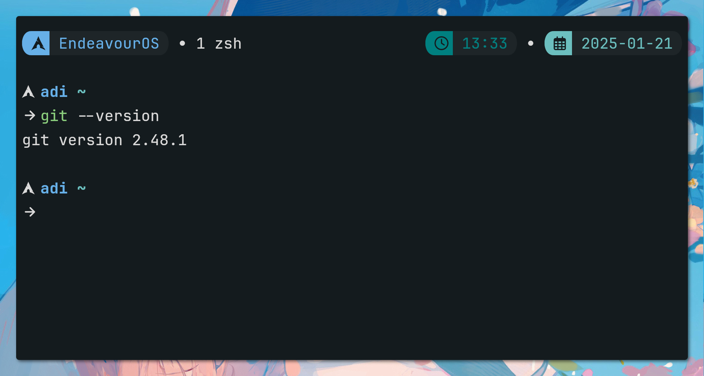

Jika muncul versi Git, artinya Git sudah terinstall pada device kita.

## Konfigurasi Awal Git

Setelah Git terinstall, kita perlu konfigurasi awal, seperti mengatur username dan email kita. Kita bisa gunakan command berikut:

```bash
git config --global user.name "Nama Kalian"
git config --global user.email "Email Kalian"
```

Saran, gunain username dan email yang sama dengan yang kalian gunain pada Github.

Lepas tu, cek konfigurasinya dengan command:
```bash
git config --list
```

Git sudah terinstall dan dikonfigurasi dengan baik pada device kita. Selanjutnya kita bisa belajar tentang Git lebih lanjut. Selalu Hello World!😏.

Source:
- [https://www.petanikode.com/git-install/](https://www.petanikode.com/git-install/)
- [https://git-scm.com/book/en/v2/Getting-Started-First-Time-Git-Setup](https://git-scm.com/book/en/v2/Getting-Started-First-Time-Git-Setup)
