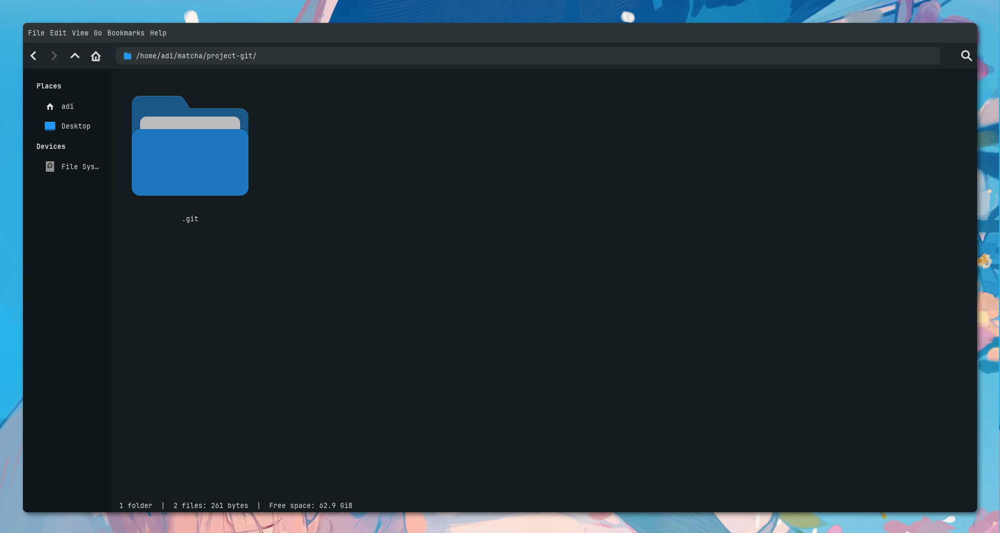

# Inisiasi Repositori dengan Git Init

## Apa itu Repositori?

Repositori jika kita ibaratkan adalah folder yang ada di file manager kita yang menampung file-file project kita. Repositori ini isinya berisi semua file yang kita kerjakan, mulai dari file source code, gambar, video, dan lain-lain.

Nahh repositori adalah istilah folder project yang menggunakan Git.

## Inisiasi Repositori

Sebelum kita menggunakan Git, kita harus inisiasi repositori dulu nih. Inisiasi repositori ini gunanya untuk ngasi tau Git kalau folder project kita ini akan kita tracking perubahannya.

Caranya gampang banget, kita buka Command Prompt atau Terminal, lalu kita arahkan ke folder project kita. Misalnya kita mau inisiasi repositori di folder `project-git`, maka kita arahkan ke folder tersebut.

Kita akan bikin folder project baru dengan nama `project-git` dan masuk ke dalam folder tersebut.

```bash
mkdir project-git
cd project-git
```

Lalu kita inisiasi repositori dengan perintah `git init`.

```bash
git init
```

Maka akan muncul pesan seperti ini:

```bash
Initialized empty Git repository in C:/Users/Adi/Documents/project-git/.git/
```

Artinya repositori kita sudah diinisiasi dan siap untuk digunakan.

Jika kita lihat folder kita di file manager, akan ada hidden folder yaitu `.git`. Folder ini berisi semua konfigurasi dan riwayat perubahan file yang kita lakukan.



## .gitignore

Ketika kita membuat project, biasanya kita menyimpan file-file yang tidak perlu di-tracking oleh Git. Misalnya file `.env`, file `.log`, file `.tmp`, dan lain-lain.

Untuk mengabaikan file-file tersebut, kita bisa membuat file `.gitignore`. File ini berisi daftar file yang tidak perlu di-tracking oleh Git.

Caranya gampang banget, kita buat file `.gitignore` di dalam folder project kita. Lalu kita tulis nama file yang tidak perlu di-tracking oleh Git.

```bash
touch .gitignore
```
Isikan ini ke .gitignore

```bash
.env
.log
.tmp
```

Maka file `.env`, `.log`, dan `.tmp` tidak akan di-tracking oleh Git.

Selanjutnya kita akan belajar cara nyimpen perubahan file ke dalam repositori dengan perintah `git add` dan `git commit`. Selalu hello world😉.
