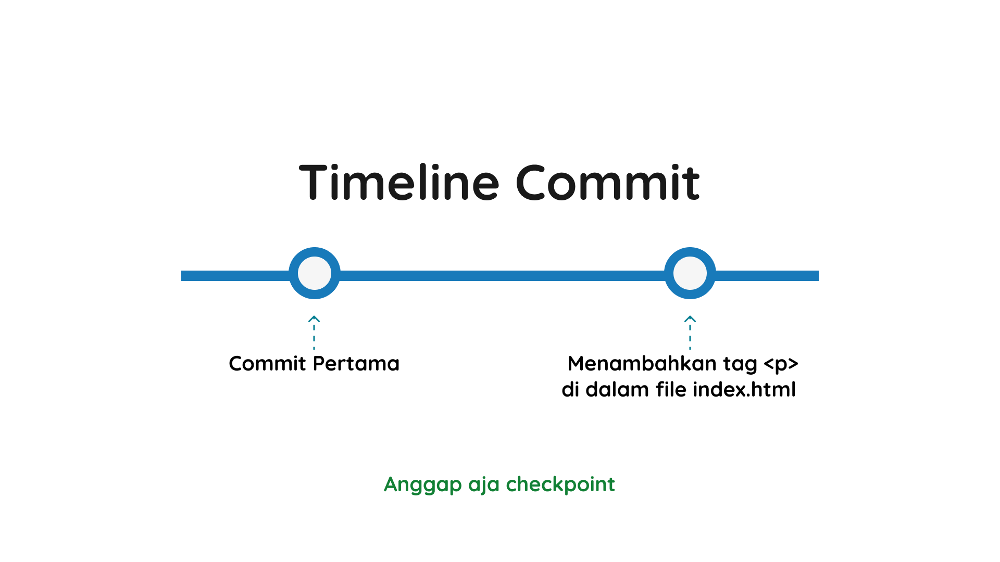

# Git Commit

Sebelumnya kita sudah bikin repositori kosong dan belum ada apa-apa di dalamnya. Nah, sekarang kita akan belajar cara nyimpen perubahan file ke dalam repositori dengan perintah `git add` dan `git commit`.

Sekarang kita akan membuat dua file di dalam repositori kita. Kita akan membuat file `index.html` dan `README.md`.

```bash
touch index.html README.md
```


Untuk file index.html kita isi dengan kode HTML sederhana.

```HTML
<!DOCTYPE html>
<html lang="en">

<head>
  <meta charset="UTF-8">
  <meta name="viewport" content="width=device-width, initial-scale=1.0">
  <title>Belajar Git</title>
</head>

<body>
  <h1>Belajar Git</h1>
</body>

</html>
```

Kemudian kita cek status repositori kita.

```bash
git status
```


Dari hasil di atas, saat ini kita ada di branch main dan ada dua file yang belum di-tracking oleh Git.

## Kondisi File dalam Git

Sebelum kita nyimpen perubahan file ke dalam repositori, kita harus tahu dulu kondisi file dalam Git.

1. **Untracked**: File yang belum pernah di-tracking oleh Git.
Untracked artinya file belum pernah di-tracking oleh Git. File ini belum pernah di-add ke dalam repositori. Dalam kasus kita sekarang, file `index.html` dan `README.md` adalah file yang belum pernah di-tracking oleh Git.

2. **Staged**: File yang sudah di-add ke dalam repositori.
Staged artinya file sudah di-add ke dalam repositori. File ini sudah pernah di-add ke dalam repositori, tapi belum pernah di-commit.

3. **Modified**: File yang sudah pernah diubah sejak terakhir commit.
Modified artinya file sudah pernah diubah sejak terakhir commit. File ini sudah pernah di-add ke dalam repositori dan sudah pernah di-commit.

4. **Committed**: File yang sudah disimpan ke dalam repositori.
Committed artinya file sudah disimpan ke dalam repositori. File ini sudah pernah di-add ke dalam repositori, sudah pernah di-commit, dan sudah disimpan ke dalam repositori.

## Git Add

Sekarang kita sudah tau nih kondisi apa saja pada file di dalam Git. Selanjutnya, kita akan mengubah kondisi kedua file kita menjadi **staged** dengan command `git add`.

```bash
git add <nama-file>
```

Contoh:

```bash
git add index.html
git add README.md
```

Atau kita ingin menambahkan semua file dan direktori:

```bash
git add .
```

Setelah itu, kita cek status repositori kita.

```bash
git status
```


Dari hasil di atas, kita sudah berhasil mengubah kondisi file `index.html` dan `README.md` menjadi **staged**. Selanjutnya, kita akan mengubah kondisi dua file tersebut menjadi **committed* agar semua perubahan disimpan oleh Git.

```bash
git commit -m "Pesan Commit (Disini bebas saja mau diisi pesan apa)"
```

Contoh:

```bash
git commit -m "Commit Pertama"
```


Dan sekarang kita cek status repositori kita.

```bash
git status
```


Dari hasil di atas, kita sudah berhasil mengubah kondisi file `index.html` dan `README.md` menjadi **committed**. Artinya semua perubahan sudah disimpan oleh Git.

## Membuat Perubahan Lagi

Kisahnya kita melakukan perubahan di file `index.html`. Kita tambahkan tag `<p>` di dalam file tersebut.

```HTML
<!DOCTYPE html>
<html lang="en">

<head>
  <meta charset="UTF-8">
  <meta name="viewport" content="width=device-width, initial-scale=1.0">
  <title>Belajar Git</title>
</head>

<body>
  <h1>Belajar Git</h1>
  <p>Hi, saya sedang belajar Git</p>
</body>

</html>
```

Kemudian kita cek status repositori kita dengan command `git status`.


Dari hasil di atas, kita sudah tau nih file mana yang sudah diubah. Selanjutnya, kita akan mengubah kondisi file `index.html` menjadi **staged** dan **committed**.

```bash
git add index.html
git commit -m "Menambahkan tag <p> di dalam file index.html"
```


Dan sekarang kita memiliki dua commit atau checkpoint di dalam repositori kita.



Dan sekarang kita udah berhasil meng-commit perubahan file `index.html`. Dari commit-commit ini kita bisa anggap sebagai **checkpoint** pada game. Jadi suatu saat jika ada kesalahan, kita bisa kembali ke **checkpoint** ini cuyy.
