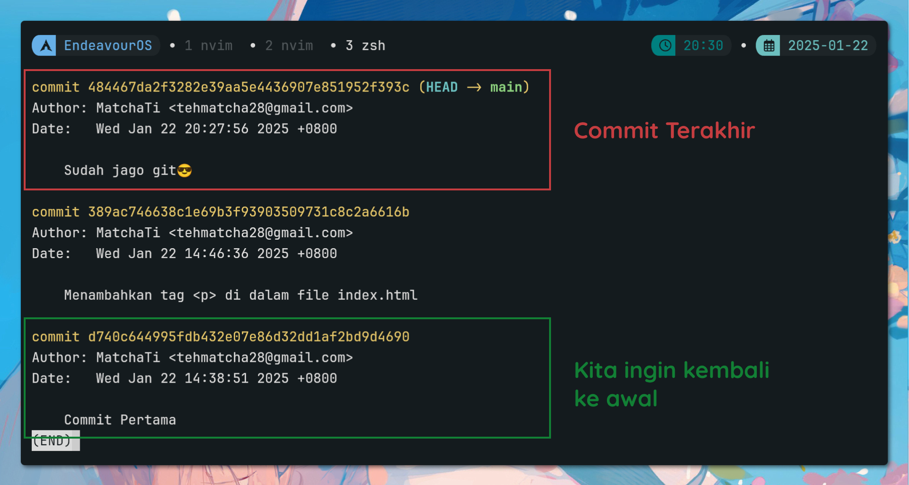

# Membatalkan Perubahan

Kita sudah belajar gimana caranya ngebandingin perubahan pada commit atau branch. Nah, sekarang kita bakal belajar gimana caranya membatalkan perubahan yang udah kita lakukan.

Terkadang kita butuh membatalkan perubahan yang udah kita lakukan, entah itu karena kita salah atau karena kita gak butuh perubahan tersebut. Git nyediain beberapa cara untuk membatalkan perubahan yang udah kita lakukan.

## Membatalkan Perubahan pada File 

Misal commit kita belum *staged* atau *commited*, kita bisa ngembaliin file tersebut ke kondisi sebelumnya. Kita bisa gunain command `git checkout`.

Contoh:

Kita akan mengubah isi dari file `index.html`:

Sebelum diubah:
```html
<!DOCTYPE html>
<html lang="en">

<head>
  <meta charset="UTF-8">
  <meta name="viewport" content="width=device-width, initial-scale=1.0">
  <title>Belajar Git</title>
</head>

<body>
  <h1>Belajar Git</h1>
  <p>Hi, saya sedang belajar Git</p>
</body>

</html>
```

Setelah diubah:
```html
<!DOCTYPE html>
<html lang="en">

<head>
  <meta charset="UTF-8">
  <meta name="viewport" content="width=device-width, initial-scale=1.0">
  <title>Belajar Git</title>
</head>

<body>
  <h1>Belajar Git</h1>
  <p>Hi, saya sudah jago git😎</p>
  <p>Belajar programming sangat menyenangkan</p>
</body>

</html>
```

Kemudian kita cek `git diff`:

```bash
diff --git a/index.html b/index.html
index 3445989..92e15cc 100644
--- a/index.html
+++ b/index.html
@@ -9,7 +9,8 @@

 <body>
   <h1>Belajar Git</h1>
-  <p>Hi, saya sedang belajar Git</p>
+  <p>Hi, saya sudah jago git😎</p>
+  <p>Belajar programming sangat menyenangkan</p>
 </body>

 </html>
```

Kita rasa perubahan tersebut gak perlu dan kita juga belum lakuin *stage* dan *commit*  , jadi kita bisa batalin perubahan tersebut dengan command:

```bash
git checkout index.html
```

Maka file `index.html` akan kembali ke kondisi sebelumnya. Kalau gak percaya, coba cek lagi `git diff` atau `git status`, lalu buka file `index.html`-nya.

Tetapi tetap hati-hati yaa dalam menggunakan command `git checkout`, karena command ini akan menghapus perubahan yang belum di-*stage* atau di-*commit*. Jadi kalau teman-teman ngoding udah beratus-ratus baris gak sengaja jalain command `git checkout`, bisa-bisa semua perubahan yang udah dilakuin ilang semua.

## Membatalkan Perubahan yang Sudah di-*Stage*

Misal kita lakuin perubahan pada file `index.html`, kemudian kita `git add index.html` untuk *staging file* tersebut. Ternyata kita gak jadi *commit* perubahan tersebut, kita bisa membatalkan *stage* file tersebut dengan command `git reset`. 

Contoh:

Kita akan mengubah isi dari file `index.html` dan mengecek dengan `git diff`:

```html
diff --git a/index.html b/index.html
index 3445989..1b98e05 100644
--- a/index.html
+++ b/index.html
@@ -9,7 +9,8 @@

 <body>
   <h1>Belajar Git</h1>
-  <p>Hi, saya sedang belajar Git</p>
+  <p>Hi, saya sudah jago Git😎</p>
+  <p>Saya senang belajar programming</p>
 </body>

 </html>
```
Setelah itu kita *stage* file tersebut:

```bash
git add index.html
```

Kemudian kita cek statusnya:

```bash
git status

On branch main
Changes to be committed:
  (use "git restore --staged <file>..." to unstage)
        modified:   index.html
```

Sekarang kondisi file `index.html` udah dalam kondisi *modified* dan *staged*. Kita gak jadi *commit* perubahan tersebut, kita bisa membatalkan *stage* file tersebut dengan command:

```bash  
git reset HEAD index.html
```

Maka file `index.html` akan kembali ke kondisi sebelum di-*stage*. Kita bisa cek statusnya lagi dengan command `git status`.

```bash
git status
On branch main
Changes not staged for commit:
  (use "git add <file>..." to update what will be committed)
  (use "git restore <file>..." to discard changes in working directory)
        modified:   index.html

no changes added to commit (use "git add" and/or "git commit -a")
```

## Membatalkan Perubahan yang Sudah di-*Commit*

Sekarang kita akan belajar gimana caranya batalin perubahan yang udah kita *commit*. Untuk lakuin ini kita perlu tau nomor commitnya. Kita bisa liat nomor commitnya dengan command `git log`.

Kita ubah lagi file `index.html` kemudian `git diff`:

```bash
diff --git a/index.html b/index.html
index 3445989..1b98e05 100644
--- a/index.html
+++ b/index.html
@@ -9,7 +9,8 @@

 <body>
   <h1>Belajar Git</h1>
-  <p>Hi, saya sedang belajar Git</p>
+  <p>Hi, saya sudah jago Git😎</p>
+  <p>Saya senang belajar programming</p>
 </body>

 </html>
```

Setelah itu kita *stage* dan *commit* perubahan tersebut:

```bash
git add index.html
git commit -m "Sudah jago git😎"
```

Kemudian kita cek log commitnya:



Kita akan kembali ke commit awal pertama kali kita commit, kita bisa gunain command:

```bash
git reset --hard <nomor-commit>
```

Contoh:

```bash
git reset --hard d740c644995fdb432e07e86d32dd1af2bd9d4690
```

Maka file `index.html` akan kembali ke kondisi sebelum kita *commit* perubahan tersebut. Kita bisa cek lagi dengan command `git diff` atau buka file `index.html`-nya. Semacam punya mesin waktu git ya, bisa balik ke masa lalu😄.

**Catatan**: Command `git reset --hard` akan menghapus semua perubahan yang udah kita lakukan, baik yang belum di-*stage* maupun yang udah di-*commit*. Jadi hati-hati dalam menggunakan command ini.
