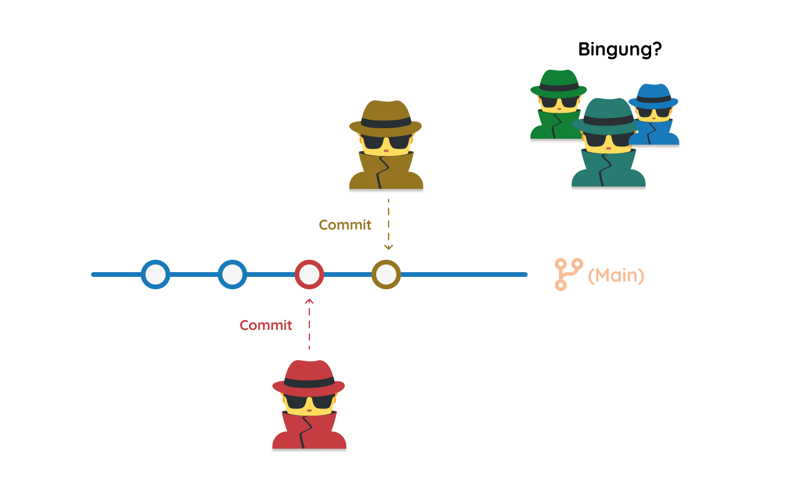
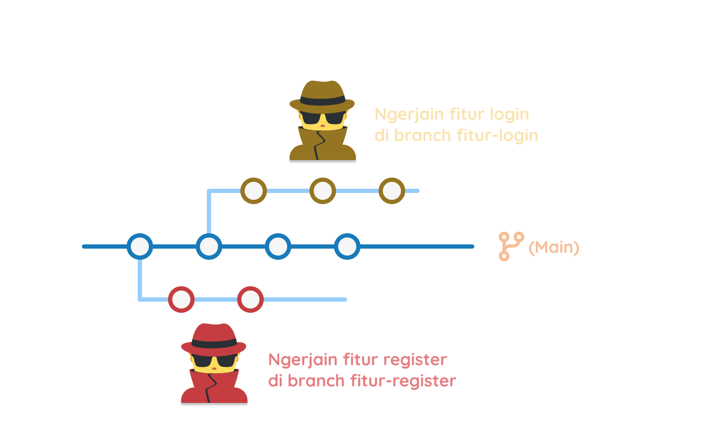
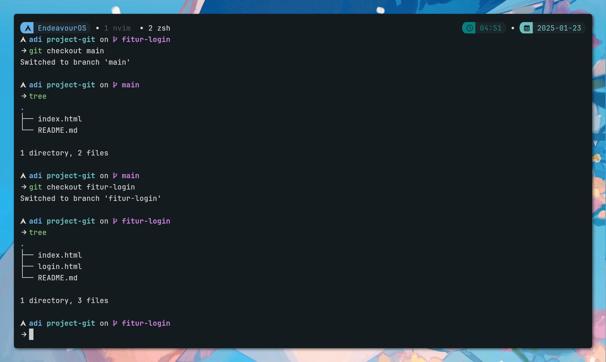
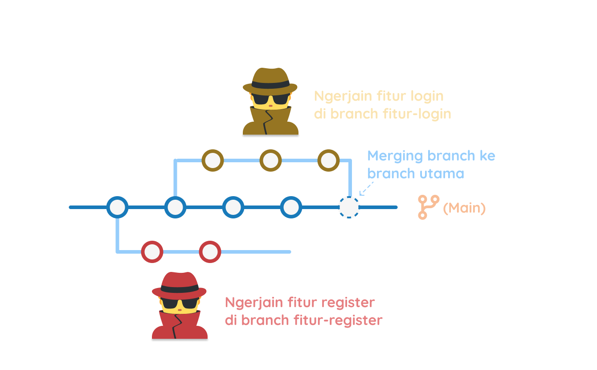

# Mencegah Konflik Rumah Tangga dengan Git Branch

Ketika kita bekerja dengan tim pada suatu repositori Git. Kadang akan terjadi konflik, ntah itu konflik pada *file* atau konflik pada *branch*. 
Konflik pada *file* biasanya terjadi ketika dua atau lebih *developer* melakukan perubahan pada *file* yang sama.
Sedangkan konflik pada *branch* biasanya terjadi ketika dua atau lebih *developer* melakukan perubahan pada *branch* yang sama.

Misal, si A ngoding untuk fitur X dengan caranya sendiri, sedangkan si B ngoding untuk fitur X dengan caranya sendiri juga.

Lalu mereka commit nihh, kemudian source code jadi berantakan. Anggota lain pun pusing.



Agar hal ini gak kejadian, kita bisa membuat *branch* tersendiri.

Kek tadi, si A bikin *branch* fitur X, maka dia bisa membuat branch sendiri. Nahh si A ini akan bebas ngelakuin apapun di branchnya tanpa ganggu branch utama (main).

## Membuat Branch

Untuk membuat *branch* di Git, kita bisa menggunakan command `git branch <nama-branch>`.

Contoh, kita akan membuat branch `fitur-login`:

```bash
git branch fitur-login
```

Maka Git akan buatin branch baru dengan nama `fitur-login`.



Sekarang, tiap orang bisa bebas ngoding di branch masing-masing. Si A di branch `fitur-login`, si B di branch `fitur-register`, dan seterusnya.

## Pindah Branch

Untuk meilhat branch apa saja yang ada di repositori kita, kita bisa menggunakan command `git branch`.

```bash
git branch
  fitur-login
* main
```

Tanda bintang (`*`) artinya cabang yang sedang kita gunakan atau kita sedang berada di branch sana.

Biar mempertajam tentang branch, kita mulai praktik.

Di repositori kita sebelumnya, kita akan membuat branch `fitur-login`:

```bash
git branch fitur-login
```

Kemudian kita pindah ke branch `fitur-login`:

```bash
git checkout fitur-login
```

Maka kita akan berada di branch `fitur-login`.
Lepas tu kita buat file `login.html` di branch `fitur-login`, isinya bebas je:

```bash
touch login.html
```

Kemudian kita *stage* dan *commit* file tersebut:

```bash
git add login.html
git commit -m "Menambahkan file login.html"
```

Mantap! Sekarang kita kembali ke branch utama yaitu `main`:

```bash
git checkout main
```

Ado tak file `login.html` di branch `main`? Gak ada dong, karena file tersebut hanya ada di branch `fitur-login`.

Sekarang kita kembali ke branch `fitur-login`:

```bash
git checkout fitur-login
```

Maka file `login.html` akan muncul lagi😁.



## Gabungin Branch

Setelah kita selesai ngoding di branch `fitur-login`, kita bisa gabungin branch tersebut ke branch utama yaitu `main`.

Pertama, kita pindah dulu ke branch `main`:

```bash
git checkout main
```

Kemudian kita gabungin branch `fitur-login` ke branch `main` dengan command `git merge`:

```bash
git merge fitur-login
```

Sekarang liat, file login.html udah ada di branch `main`. 



## Ngatasin konflik

Kadang, saat kita gabungin branch, bisa terjadi konflik. Lho kok bisa? Kan udah punya branch masing-masing?

Bisa jadi, di branch yang mereka kerjain ada file yang sama dengan branch lain. Jadi, ketika digabungin terjadilah konflik.

Misal, si A di branch `fitur-login` mengubah file `index.html`, sedangkan si B di branch `main` juga mengubah file `index.html`.

Disinilah ada orang yang ngambil peran sebagai penengah, pemilik atau pengelola repositori. Biasanya, mereka akan memilih perubahan mana yang akan diambil.

Sekarang kita akan buat konflik di file `index.html`.

Pertama, kita pindah ke branch `fitur-login`:

```bash
git checkout fitur-login
```

Lepas tu kita ubah file `index.html`, kemudian `git diff`:

```bash
diff --git a/index.html b/index.html
index b849816..a1f0ab3 100644
--- a/index.html
+++ b/index.html
@@ -8,7 +8,7 @@
 </head>

 <body>
-  <h1>Belajar Git</h1>
+  <h1>Belajar Git itu Menyenangkan</h1>
 </body>

 </html>
```

Kemudian kita *stage* dan *commit* perubahan tersebut:

```bash
git add index.html
git commit -m "Mengubah judul di index.html di branch fitur-login"
```

Sekarang kita pindah ke branch `main`:

```bash
git checkout main
```

Lepas tu kita ubah file `index.html` juga, kemudian `git diff`:

```bash
diff --git a/index.html b/index.html
index b849816..d75e901 100644
--- a/index.html
+++ b/index.html
@@ -8,7 +8,7 @@
 </head>

 <body>
-  <h1>Belajar Git</h1>
+  <h1>Sudah Jago Git😎</h1>
 </body>

 </html>
```

Kemudian kita *stage* dan *commit* perubahan tersebut:

```bash
git add index.html
git commit -m "Mengubah judul di index.html di branch main"
```

Sekarang kita akan gabungin branch `fitur-login` ke branch `main`:

```bash
git merge fitur-login
```

Nah, disini akan muncul konflik. Git akan memberitahu kita file mana yang konflik.

```bash
 git merge fitur-login
Auto-merging index.html
CONFLICT (content): Merge conflict in index.html
Automatic merge failed; fix conflicts and then commit the result.
```

Kita bisa lihat file `index.html`, jadi buka text editor kita:

```bash
<<<<<<< HEAD
  <h1>Sudah Jago Git😎</h1>
=======
  <h1>Belajar Git itu Menyenangkan</h1>
>>>>>>> fitur-login
```

Bagian `<<<<<<< HEAD` adalah perubahan di branch `main`, sedangkan `>>>>>>> fitur-login` adalah perubahan di branch `fitur-login`.

Kita bisa memilih perubahan mana yang akan diambil. Misal, kita ambil perubahan di branch `fitur-login`.

Disini kita akan mengambil yang di branch `fitur-login`, jadi kita hapus `<<<<<<< HEAD` sampai `=======`.

Awalnya seperti ini:

```html
<!DOCTYPE html>
<html lang="en">

<head>
  <meta charset="UTF-8">
  <meta name="viewport" content="width=device-width, initial-scale=1.0">
  <title>Belajar Git</title>
</head>

<body>
<<<<<<< HEAD
  <h1>Sudah Jago Git😎</h1>
=======
  <h1>Belajar Git itu Menyenangkan</h1>
>>>>>>> fitur-login
</body>

</html>
```

Jadinya seperti ini:

```html
<!DOCTYPE html>
<html lang="en">

<head>
  <meta charset="UTF-8">
  <meta name="viewport" content="width=device-width, initial-scale=1.0">
  <title>Belajar Git</title>
</head>

<body>
  <h1>Belajar Git itu Menyenangkan</h1>
</body>

</html>
```

Setelah itu, kita *stage* dan *commit* perubahan tersebut:

```bash
git add index.html
git commit -m "Merge branch fitur-login"
```

Mantap! Konflik sudah diatasi. Dan cek juga file `index.html` di branch `fitur-login` dan `main`, sudah sama kan?

## Menghapus Branch

Setelah branch `fitur-login` sudah digabungin ke branch `main`, kita bisa hapus branch `fitur-login` karena dirasa sudah tidak diperlukan lagi.

```bash
git branch -d fitur-login
```

`-d` sebuah flag untuk menghapus branch. Jika branch yang akan dihapus belum digabungin ke branch lain, kita bisa gunakan `-D`.

Maka branch `fitur-login` akan dihapus. Cek dengan `git branch`.
